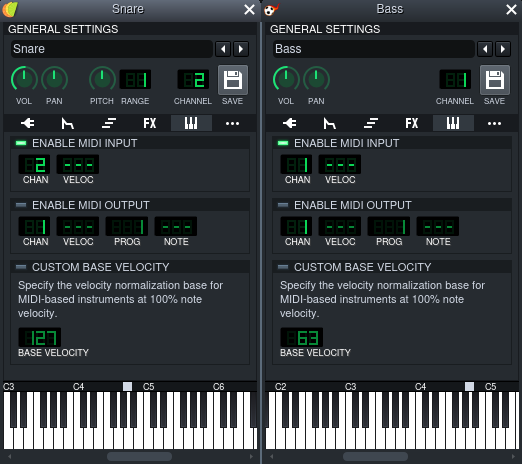

# Introduction
> This document is a work-in-progress and
> contributions are welcome.

For installation and setup, this guide will assume you are running
Void Linux (because that's what I'm familiar with) but a lot of these
instructions should be applicable to most other distros.

I am also going to use LMMS in order to turn our MIDI data from Cane
into sound but you can use whatever you like instead.

### Setting Up An Audio Server
Cane depends on the JACK audio server in order to facilitate the routing
of MIDI.

There are two options you can use for setting up a JACK server.

1. JACK
2. PipeWire

PipeWire includes an implementation of a JACK server and is fairly easy to set up
so that's what we'll be using in this guide. Anyone wishing to use JACK is likely
already using it and knows what to do.

To download PipeWire, we run:
```sh
$ xbps-install -S pipewire libjack-pipewire
```

We're also going to need the JACK development libraries for building Cane.
```sh
$ xbps-install -S jack-devel
```

Next, we need to make sure to point the dynamic linker to the PipeWire JACK
libraries. There are two options we can use and the choice will really come down
to personal preference.

1. `pw-jack`
2. Override JACK libraries with PipeWire libraries

Overriding the JACK libraries may cause issues if you use JACK outside of PipeWire
so use it only if you're confident that you'll be sticking to PipeWire.

To use `pw-jack`, you just have to insert it in front of running `cane` like so:
```sh
$ pw-jack cane -f foo.cn -m bar
```

To override the JACK libraries, run:
```sh
$ echo "/usr/lib/pipewire-0.3/jack" > /etc/ld.so.conf.d/pipewire-jack.conf
$ ldconfig
```

Lastly, we need to launch the PipeWire server:
```sh
$ pipewire
```

And with that, we should now be good to go. PipeWire usually doesn't require any
complex configuration out of the box.

If you need any more information about PipeWire, check the following resources:
- https://docs.voidlinux.org/config/media/pipewire.html
- https://wiki.archlinux.org/title/PipeWire
- https://pipewire.org/

### Build & Install
Run the following commands to clone the repository and build Cane:
```sh
$ git clone --recursive https://github.com/Jackojc/cane && cd cane
$ make dbg=no  # Release build
```

This will place the Cane binary in `build/`. You can use Cane from here
or install it by running:
```sh
$ make install
```

You may wish to change the PREFIX directory:
```sh
$ PREFIX=/usr/bin make install
```

You should now be able to run Cane:
```sh
$ cane -f foo.cn -m bar
```

### Connecting To A MIDI Device
Cane cannot produce any sound by itself. That is the job of whatever is on the
receiving end of the MIDI messages produced by Cane.

Cane can talk to any MIDI aware device through JACK which includes most software
synthesisers or even hardware synthesisers.

In cases where you can't use JACK, you can use `j2amidi_bridge`
(from [a2jmidid](https://github.com/jackaudio/a2jmidid)) to translate from
JACK to ALSA.

I'm going to use LMMS here but feel free to use whatever you like.

##### Configuring LMMS
Make sure that you have "Jack-MIDI" selected in the LMMS MIDI settings dialog:


LMMS must be compiled with support for JACK in order to use JACK directly. If
your distribution of LMMS does not support JACK MIDI natively, you can instead
use the ALSA MIDI backend and route Cane through `j2amidi_bridge` and then to
LMMS.

Once you've got LMMS set up to work with JACK MIDI, you're going to want to set
up a synth to receive MIDI on a particular channel.

You just have to go to the MIDI tab, enable MIDI input and set a channel:


We're now ready to start making some beats with Cane!

### A Basic Beat
Let's begin with something simple.

We'll need two instruments for this beat: A bass drum and a snare drum.

LMMS comes with many presets, so pick out two that you like and drag them
over to the "Song-Editor".


Once you've picked out two synths that you like, set them up to receive
MIDI like shown previously.



First things first, let's set up a global tempo and a base note.
```
bpm 120
note 60
```

Next, we'll define some useful constants.
```
let qn bpm * 4  # Quarter Note
let hn bpm * 2  # Half Note
let fn bpm      # Full Note
```

Now we're going to assign names to the MIDI channels we set up earlier in LMMs.
```
# MIDI Channels
alias c_bd 1
alias c_sn 2
```

One final bit of boilerplate before we get onto the fun part; We are going to
define the notes to use for our instruments. Because we're just dealing with
drums here, we want to use a single note throughout the sequence. If you're
working with samples here, this is especially important so as not to stretch
the sample by pitching up or down (unless you want that of course).

When we have our synth open in LMMS, it tells us the base note for a synth at
the bottom above the piano keys:


If we right click this small white rectangle, it will show us the value of the
base note. In my case, this value is `69` for both the snare and bass but you
should use whatever value is shown for you. If you're working with samples,
you will need to adjust the base note in LMMS to avoid stretching.

```
let bd 69  # Base Note for Bass Drum
let sn 69  # Bass Note for Snare Drum
```

Okay nice! The boilerplate is out of the way and we can get to the fun part!

##### Bass Drum
We'll lay out our sequence for the bass drum first:
```
!..! ..!. ..!. .... map bd @ qn => bd_bar  # Assign this bar to `bd_bar`
```

We've done a few things here so lets break it down:

1. Our sequence consists of a series of "steps" either `!` or `.`. These represent
beats and skips. `!` produces a note while `.` simply passes time.

2. We've used "note mapping" (`map bd`) to map the value of `bd` (`69`
in my case) across all of the active steps in the sequence. This means whenever
we encounter `!`, we emit a MIDI note with the value of `bd`. Inactive steps are
simply skipped when doing note mapping.

3. The tempo for the sequence is set using the bpm operator (`@ qn`). We have a
16 step sequence here and want to use quarter notes so we use the `qn` value we
assigned earlier.

4. Finally, we assign this sequence to a name `bd_bar` so we can reference it later.

##### Snare Drum
The code for the snare drum sequence is much the same but substituting `bd` with
`sn` and obviously using a different sequence.
```
.... !... .... !... map sn @ qn => sn_bar  # Assign this bar to `sn_bar`
```

Excellent! We now have a 16 step sequence consisting of our snare and bass drum.
If you try to run Cane now:
```sh
$ cane -f beat.cn -m lmms
```
you'll notice that nothing happens. This is because we have simply _defined_
the sequences but have not sent them to the appropriate MIDI channels so let us
go ahead and do that:
```
send c_bd bd_bar  # `send` will output the sequence on the named MIDI channel.
send c_sn sn_bar
```

Give it a try by running Cane... Uh-oh. Something is wrong here. We wanted
both of our instruments to play together on top of each other but they're playing
in sequence one after the other.

This is where we have to introduce the concept of "layering" in Cane which is
fundamental to building beats. The layering operator (`$`) is a statement much like
`send` meaning we can only use it inbetween two `send` statements and _not_
between two sequence expressions.

We use it like this:
```
send c_bd bd_bar $
send c_sn sn_bar
```

Perfect! If we now try running this with Cane, we get the result we wanted: The
bass drum and snare drum are playing together and we have our basic hiphop style
bar!

I encourage you to play around and experiment here before we move onto something
a little bit more complex.

([full code](examples/basic-beat.cn))

### Four On The Floor
Now let's try something a bit more complex. We're going to write a "four on the
floor" pattern which is very common in Disco and EDM.

To start off, we will define our metadata and some constants:
```
bpm 124
note 58  # A#3

let en bpm * 8  # Eight Notes
let qn bpm * 4  # Quarter Notes
let hn bpm * 2  # Half Notes
let fn bpm * 1  # Full Notes

let n note  # Shorthand

let o1 n + 12 * 0
let o2 n + 12 * 1
let o3 n + 12 * 2
```

Next, let's define our MIDI channels and base notes:
```
# MIDI Channels
alias c_bd 1  # Bass Drum
alias c_sn 2  # Snare Drum
alias c_oh 3  # Open HiHat
alias c_ch 4  # Closed HiHat
alias c_cb 5  # Cowbell
alias c_gb 6  # Gritty Bass
alias c_sh 7  # Shaker
alias c_bs 8  # Bass

# MIDI Base Notes
let bd 69  # Bass Drum Base Note
let sn 69  # Snare Drum Base Note
let oh 69  # Open HiHat Base Note
let ch 69  # Closed HiHat Base Note
let cb 69  # Cowbell Base Note
let sh 1   # Shaker Base Note
```

So far we haven't encountered anything new but let's introduce a new concept:
euclidean rhythms. You have seen previously how to manually define sequences using
steps but euclidean rhythms give us a shorthand way to generate complex rhythms
with ease.

If you're interested in the details of how euclidean rhythms work, take a look at
[this paper](http://cgm.cs.mcgill.ca/~godfried/publications/banff-extended.pdf).

Euclidean rhythms consist of two numbers: the number of active steps and the total
number of steps. For example, we can define a basic "four on the floor" rhythm using
`4:16` or four active steps distributed evenly over a total of sixteen steps.

If we take a look at the generated rhythm, it looks like: `!...!...!...!...`.

You can really go wild here and get some very interesting rhythms, especially if
you layer a bunch of them together.

Let us incorporate some into our beat:
```
# Bars
# seconds = 60 / bpm * steps
4:16        @ qn ** 4 => b_bd  # !...!...!...!... (x4=64)  @ 496bpm = 7.74s
2:16   > 4  @ qn ** 4 => b_sn  # ....!.......!... (x4=64)  @ 496bpm = 7.74s
4:16   > 2  @ qn ** 4 => b_ch  # ..!...!...!...!. (x4=64)  @ 496bpm = 7.74s
1:16   > 3  @ qn ** 4 => b_cb  # ...!............ (x4=64)  @ 496bpm = 7.74s
16:128 > 10 @ en ** 1 => b_sh  # ..!.......!..... (x8=128) @ 992bpm = 7.74s

!..! ..!. ..!. ..!! @ qn ** 4 => b_bs  # !..!..!...!...!! (x4=64) @ 496bpm = 7.74s
20:64               @ qn ** 1 => b_gb  # !...!..!..!..!.. (x4=64) @ 496bpm = 7.74s
```

That's a lot to take in so let's summarise:

1. We see two new operators in use here: `>` and `**`. `>` simply rotates the
sequence to the right by a specified number of places and `**` simply repeats
the sequence a number of times. If we had `1:4 > 2 ** 4`, the resulting sequence
would be: `..!. ..!. ..!. ..!.`.

> hint: you can use the debug operator (`?`) to preview a sequence: `1:4 > 2 ** 4?`.

2. We're using a number of sequences which are 64 steps long and a single sequence
(`b_sh`) that is 128 steps long. How do they end up taking the same amount of time?
The answer is simply that `b_sh` is twice as long but plays twice as fast and so
ends up taking the same absolute duration as the other sequences. We do this so that
we can use eight notes here.

3. There's a short formula you can use the calculate the absolute duration of a
sequence with given size and BPM: `seconds = 60 / bpm * steps`. We use this to make
sure that all of the sequences finish at the same time so we can re-use this bar.

The last thing we need to do now is layer all of our sequences together and play
them.

First, our underlying beat:
```
  send c_bd b_bd map bd
$ send c_sn b_sn map sn
$ send c_ch b_ch map ch
$ send c_cb b_cb map cb
$ send c_sh b_sh map sh
```

Next, our melody:
```
$ send c_bs b_bs map
	o1 - 4  o2 - 4  o1 - 4  o2 - 4
	o1 - 7  o2 - 7  o1 - 7  o2 - 7
	o1 - 5  o2 - 5  o1 - 5  o2 - 5
	o1      o2      o1      o2

$ send c_gb b_gb map
	o1 + 3  o1 + 3  o1 + 3  o1 + 5
	o1 + 3  o1 + 5  o1 + 5  o1 + 8
	o1 + 5  o1 + 8  o1 + 8  o1
	o1 + 8  o1      o1      o1
```

([full code](examples/four-on-the-floor.cn))

### Something Weird

### Where To Go From Here
Now that you're familiar with the basics of Cane there are a few things you
can do to learn more:

- Check out the `examples/` directory for more complicated compositions
- Read the [reference](ref.md) for a more in-depth look at how Cane works
- Join the [Discord](https://discord.gg/Qqguu9SRvU) to talk with us
