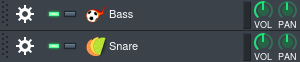

# Introduction
> This document is a work-in-progress and
> contributions are welcome.

For installation and setup, this guide will assume you are running
Void Linux (because that's what I'm familiar with) but a lot of these
instructions should be applicable to most other distros.

I am also going to use LMMS in order to turn our MIDI data from Cane
into sound but you can use whatever you like instead.

### Setting Up An Audio Server
Cane depends on the JACK audio server in order to facilitate the routing
of MIDI.

There are two options you can use for setting up a JACK server.

1. JACK
2. PipeWire

PipeWire includes an implementation of a JACK server and is fairly easy to set up
so that's what we'll be using in this guide. Anyone wishing to use JACK is likely
already using it and knows what to do.

To download PipeWire, we run:
```sh
$ xbps-install -S pipewire libjack-pipewire
```

We're also going to need the JACK development libraries for building Cane.
```sh
$ xbps-install -S jack-devel
```

Next, we need to make sure to point the dynamic linker to the PipeWire JACK
libraries. There are two options we can use and the choice will really come down
to personal preference.

1. `pw-jack`
2. Override JACK libraries with PipeWire libraries

Overriding the JACK libraries may cause issues if you use JACK outside of PipeWire
so use it only if you're confident that you'll be sticking to PipeWire.

To use `pw-jack`, you just have to insert it in front of running `cane` like so:
```sh
$ pw-jack cane -f foo.cn -m bar
```

To override the JACK libraries, run:
```sh
$ echo "/usr/lib/pipewire-0.3/jack" > /etc/ld.so.conf.d/pipewire-jack.conf
$ ldconfig
```

Lastly, we need to launch the PipeWire server:
```sh
$ pipewire
```

And with that, we should now be good to go. PipeWire usually doesn't require any
complex configuration out of the box.

### Build & Install
Run the following commands to clone the repository and build Cane:
```sh
$ git clone --recursive https://github.com/Jackojc/cane && cd cane
$ make dbg=no  # Release build
```

This will place the Cane binary in `build/`. You can use Cane from here
or install it by running:
```sh
$ make install
```

You may wish to change the PREFIX directory:
```sh
$ PREFIX=/usr/bin make install
```

You should now be able to run Cane:
```sh
$ cane -f foo.cn -m bar
```

### Connecting To A MIDI Device
Cane cannot produce any sound by itself. That is the job of whatever is on the
receiving end of the MIDI messages produced by Cane.

Cane can talk to any MIDI aware device through JACK which includes most software
synthesisers or even hardware synthesisers.

In cases where you can't use JACK, you can use `j2amidi_bridge`
(from [a2jmidid](https://github.com/jackaudio/a2jmidid)) to translate from
JACK to ALSA.

I'm going to use LMMS here but feel free to use whatever you like.

##### Configuring LMMS
Make sure that you have "Jack-MIDI" selected in the LMMS MIDI settings dialog:


LMMS must be compiled with support for JACK in order to use JACK directly. If
your distribution of LMMS does not support JACK MIDI natively, you can instead
use the ALSA MIDI backend and route Cane through `j2amidi_bridge` and then to
LMMS.

Once you've got LMMS set up to work with JACK MIDI, you're going to want to set
up a synth to receive MIDI on a particular channel.

You just have to go to the MIDI tab, enable MIDI input and set a channel:


We're now ready to start making some beats with Cane!

### A Basic Beat
Let's begin with something simple.

We'll need two instruments for this beat: A bass drum and a snare drum.

LMMS comes with many presets, so pick out two that you like and drag them
over to the "Song-Editor".




Once you've picked out two synths that you like, set them up to receive
MIDI like shown previously.


First things first, let's set up a global tempo and a base note while we're at it.
```
# Metadata
bpm 120
note 60
```

Next, we'll define some useful constants.
```
let qn bpm * 4  # Quarter Note
let hn bpm * 2  # Half Note
let fn bpm      # Full Note
```

Now we're going to assign names to the MIDI channels we set up earlier in LMMs.
```
# MIDI Channels
alias c_bd 1
alias c_sn 2
```

One final bit of boilerplate before we get onto the fun part; We are going to
define the notes to use for our instruments. Because we're just dealing with
drums here, we want to use a single note throughout the sequence. If you're
working with samples here, this is especially important so as not to stretch
the sample by pitching up or down (unless you want that of course).

When we have our synth open in LMMS, it tells us the base note for a synth at
the bottom above the piano:


If we right click this small white rectangle, it will show us the value of the
base note. In my case, this value is `69` for both the snare and bass but you
should use whatever value is shown for you. If you're working with samples,
you will need to set this value yourself to avoid stretching.

```
let bd 69  # Base Note for Bass Drum
let sn 69  # Bass Note for Snare Drum
```

Okay nice! The boilerplate is out of the way and we can get to the fun part!

##### Bass Drum
We'll lay out our sequence for the bass drum first:
```
!..! ..!. ..!. .... map bd @ qn => bd_bar  # Assign this bar to `bd_bar`
```

We've done a few things here so lets break it down:

1. Our sequence consists of a series of "steps" either `!` or `.`. These represent
beats and skips. `!` produces a note while `.` simply passes time.

2. We've used "note mapping" (`map bd`) to map the value of `bd` (`69`
in my case) across all of the active steps in the sequence. This means whenever
we encounter `!`, we emit a MIDI note with the value of `bd`. Inactive steps are
simply skipped when doing note mapping.

3. The tempo for the sequence is set using the bpm operator (`@ qn`). We have a
16 step sequence here and want to use quarter notes so we use the `qn` value we
assigned earlier.

4. Finally, we assign this sequence to a name `bd_bar` so we can reference it later.

##### Snare Drum
The code for the snare drum sequence is much the same but substituting `bd` with
`sn` and obviously using a different sequence of steps.
```
.... !... .... !... map sn @ qn => sn_bar  # Assign this bar to `sn_bar`
```

Excellent! We now have a 16 step sequence consisting of our snare and bass drum.
If you try to run Cane now though, you'll notice that nothing happens. This is
because we have simply _defined_ the sequences but not sent them to the appropriate
MIDI channels so let us go ahead and do that:
```
send c_bd bd_bar  # We use the `send` keyword to "send" a sequence to a MIDI channel.
send c_sn sn_bar
```

Now give it a try running with Cane... Uh-oh. Something is wrong here, we wanted
both of our instruments to play together on top of eachother but they're playing
in sequence one after the other.

This is where we have to introduce the concept of "layering" in Cane which is
fundamental to building beats. The layering operator (`$`) is a statement much like
`send` meaning we can only use it inbetween two `send` statements and _not_ two
sequence expressions.

We simply use it like this:
```
send c_bd bd_bar $
send c_sn sn_bar
```

Perfect! If we now try running this with Cane, we get the result we wanted: The
bass drum and snare drum are playing together and we have our basic hiphop style
bar!

I encourage you to play around and experiment here before we move onto something
a little bit more complex.

### Four On The Floor

### Something Weird

### Where To Go From Here
Now that you're familiar with the basics of Cane there are a few things you
can do to learn more:

- Check out the `examples/` directory for more complicated compositions
- Read the [reference](ref.md) for a more in-depth look at how Cane works
- Join the [Discord](https://discord.gg/Qqguu9SRvU) to talk with us
